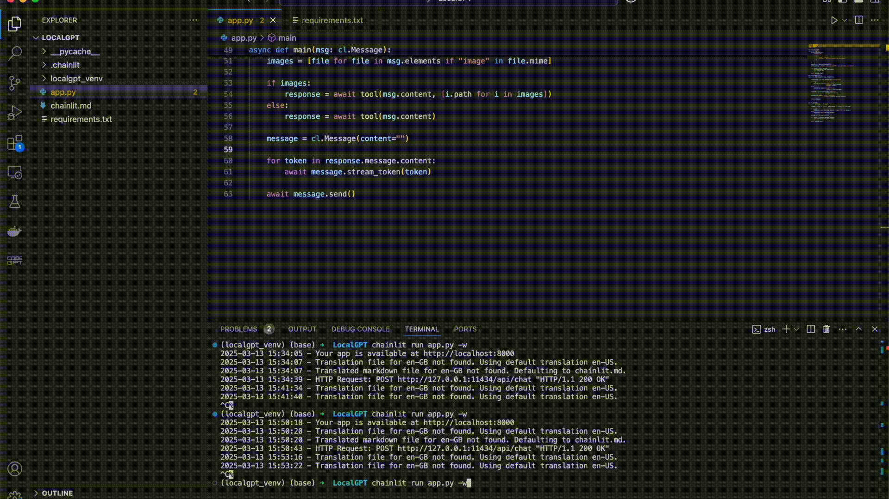

# LocalGPT: Run 100% Locally with Ollama & Gemma 3

LocalGPT is a fully local AI chatbot powered by **Google DeepMind's Gemma 3** (4B variant), running on **Ollama** for inference and **Chainlit** for an interactive conversational UI. This guide will help you set up and run LocalGPT on your system.



## Getting Started

### 1️⃣ Install Ollama
Ollama is required to run the **Gemma 3** model locally. Install Ollama based on your operating system:

#### **MacOS (Intel & Apple Silicon) and Linux**
```sh
curl -fsSL https://ollama.com/install.sh | sh
```

#### **Windows (via WSL)**
1. Install **Windows Subsystem for Linux (WSL2)** if not already installed.
2. Open WSL and run:
   ```sh
   curl -fsSL https://ollama.com/install.sh | sh
   ```

### 2️⃣ Pull the Required Model
Once Ollama is installed, pull the **Gemma 3 (4B)** model:
```sh
ollama pull gemma3:4b
```
📌 **Note:** Ensure your system meets the memory requirements:
- **8 GB RAM** for **7B models**
- **16 GB RAM** for **13B models**
- **32 GB RAM** for **33B models**

### 3️⃣ Install Dependencies (if needed)
Ensure you have Python installed (`>=3.8`). Install **Chainlit** for UI interaction:
```sh
pip install chainlit
```

### 4️⃣ Run LocalGPT
To start the chatbot, navigate to your project directory and run:
```sh
chainlit run app.py -w
```
This will launch the **Chainlit UI**, allowing you to chat with LocalGPT directly in your browser.

## Features
- **100% Local**: No internet required, ensuring privacy.
- **Powered by Gemma 3**: Advanced AI capabilities optimized for local inference.
- **Conversational UI**: Built with **Chainlit** for seamless interactions.

## Troubleshooting
- If you encounter model loading errors, ensure **Ollama is running** by executing:
  ```sh
  ollama run gemma3:4b
  ```
- If memory issues arise, consider using **a smaller model variant** or closing unnecessary applications.

## Contributing
Feel free to **fork** this repository, suggest improvements, or report issues!

---
Enjoy running **LocalGPT** completely offline!
